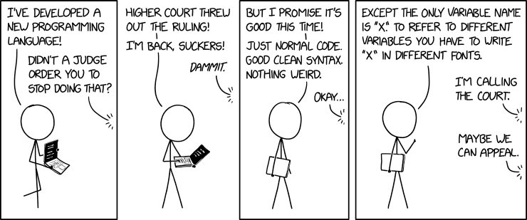

# x

X: A programming language that only accepts identifiers that look like the letter 'x'.

  



Based on the idea from [xkcd 2309](https://xkcd.com/2309/).

# About
In the X language, only characters that closely resemble the letter 'x' can be used to define variables or functions. Any attempt to use a character that does not closely enough resemble an 'x' will result in a syntax error.

X currently provides the following 17 possible identifiers which may be used to define variables or functions:
```
Χ, χ, ҳ, 𝔵, 𝖝, 𝔁, 𝕩, 𝚡, 乂, ﾒ, ✕, ✖, ✗, ✘, 🗙, 🗴, ᚷ
```
Additionally, X has four further identifiers which have a reserved or built-in use:

 - `x`, which is the entry point of the program. All X programs should  have at least one `func x(){}`.
 - `X`, which is used to print to `stdout`.
 - `х`, which takes integer inputs from `stdin`.
 - `ӽ`, which takes string inputs from `stdin`.

The X compiler only supports ASCII characters in the source code, with the only exception being that identifiers may be a Unicode character, as long as it closely resembles the appearance of the letter 'x'. Any attempts to use a non-ASCII character that does not resemble an 'x' will result in a compiler error.

# Usage

X programs can be compiled with the following command:
```
x file.x [-h] [-s] [-o outfile=a.out] [-c compiler=clang]
```
X source code is first transcompiled into C, before being compiled to an executable.
- `-h` displays these options and exits.
- `-o` specifies the output file, which is `a.out` by default.
- `-s` outputs the file as C source code and does not compile to an executable.
- `-c` specifies the compiler which is used to compile the C source code into an executable. The compiler is `clang` by default, but this can be changed to another compiler such as `gcc`.

# Examples

#### helloworld.x
```c
func x(){
    X("hello world!\n",);
}
```

#### greet.x
```c
func x(){
    let Χ = "Hello, " + ӽ("What is your name? ",);
    X(Χ,);
    X("\n",);
}
```

#### fibonacci.x
```c
func 𝕩(✗){
    if(✗<=1)
        return ✗;
    return 𝕩(✗-1,)+𝕩(✗-2,);
}
func x(){
    let 🗙 = х("Enter a number: :",);
    X(𝕩(🗙,),);
    X("\n",);
}
```

### fizzbuzz.x
```c
func x(){
    let Χ = 1;
    while(Χ<101){
        if(Χ%15==0)
            X("FizzBuzz",);
        if((Χ%3==0)&&(Χ%5!=0))
            X("Fizz",);
        if((Χ%3!=0)&&(Χ%5==0))
            X("Buzz",);
        if((Χ%3!=0)&&(Χ%5!=0))
            X(Χ,);
        X("\n",);
        Χ = Χ+1;
    }
}
```

# FAQ
### Why?
I have way too much free time.
